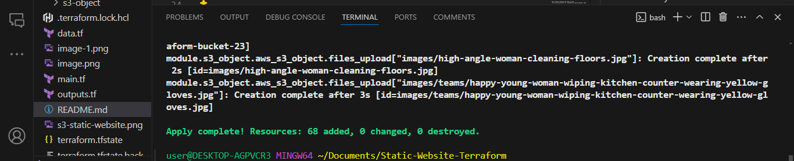
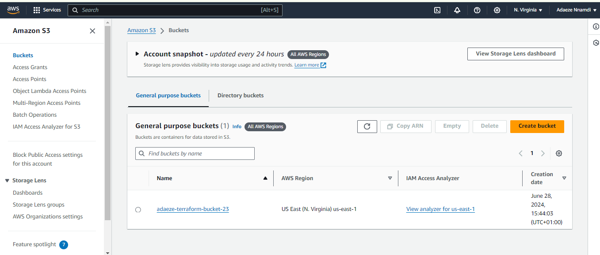
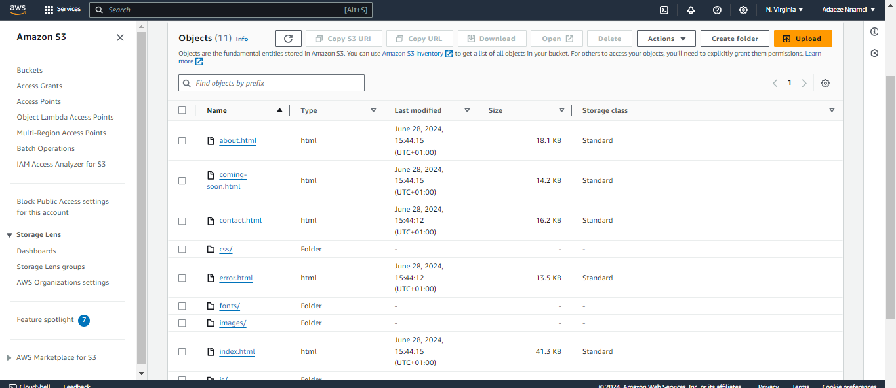
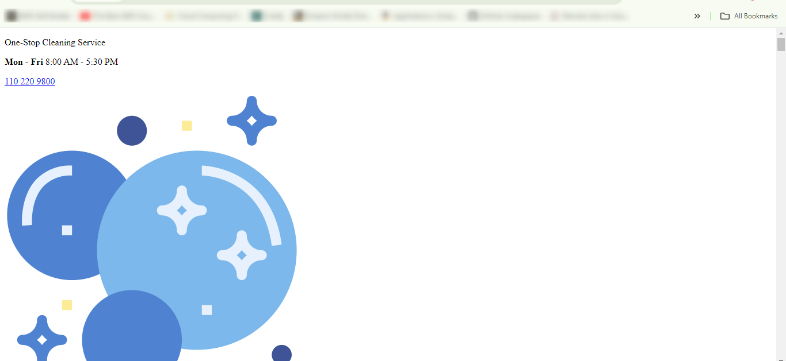
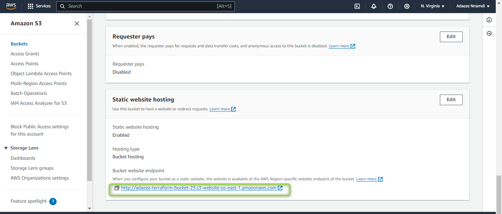

### Project Overview

This project demonstrates how to use Terraform to create an AWS S3 bucket and upload files to it. The setup includes configuring a website on S3 and managing access policies to ensure proper permissions. The project is divided into two main parts: creating an S3 bucket and uploading files to the bucket.

### File Structure
```
├── modules
│   ├── s3-object
│   │   └── home-cleaning-website-23
│   │       ├── index.html
│   │       ├── error.html
│   │       └── additional_files
├── main.tf
├── outputs.tf
├── README.md
└── variables.tf
```
### File Descriptions
- `main.tf`: Contains the main configuration for the S3 bucket and S3 object upload.
- `outputs.tf`: Defines the outputs for the Terraform script, including the bucket name.
- `README.md`: This documentation file.
- `variables.tf`: Defines variables used in the Terraform configuration.
- `modules/s3-object/home-cleaning-website-23`: Directory containing the files to be uploaded to the S3 bucket.

### Prerequisites
- AWS Account with appropriate permissions.
- Terraform installed on your local machine.
- AWS CLI configured with your AWS credentials.

## Configuration Details

#### S3 Bucket Configuration
The `main.tf` file for the S3 bucket includes the following resources:



**S3 Bucket**
```
resource "aws_s3_bucket" "adaeze-terraform-bucket-23" {
  bucket = "adaeze-terraform-bucket-23"
}

```

This resource creates an S3 bucket named `adaeze-terraform-bucket-23`.



**S3 Bucket Public Access Block**

```
resource "aws_s3_bucket_public_access_block" "block_access" {
  bucket = "adaeze-terraform-bucket-23"
  block_public_acls       = false
  block_public_policy     = false
  ignore_public_acls      = false
  restrict_public_buckets = false
}

```

This resource configures the public access settings for the S3 bucket.

**S3 Bucket Website Configuration**

```
resource "aws_s3_bucket_website_configuration" "website-config" {
  bucket = "adaeze-terraform-bucket-23"

  index_document {
    suffix = "index.html"
  }

  error_document {
    key = "error.html"
  }
}

```

This resource configures the S3 bucket to host a static website with `index.html` as the main document and `error.html` as the error document.

**S3 Bucket Policy**

```
resource "aws_s3_bucket_policy" "allow_access_from_another_account" {
  bucket = "adaeze-terraform-bucket-23"
  policy = data.aws_iam_policy_document.allow_access_from_another_account.json
}

data "aws_iam_policy_document" "allow_access_from_another_account" {
  statement {
    principals {
      type        = "AWS"
      identifiers = ["*"]
    }

    actions = [
      "s3:GetObject",
      "s3:ListBucket",
    ]

    resources = [
      aws_s3_bucket.adaeze-terraform-bucket-23.arn,
      "${aws_s3_bucket.adaeze-terraform-bucket-23.arn}/*",
    ]
  }
}

```

This resource defines the bucket policy, allowing public read access to the bucket.

**S3 Object Upload Configuration**

```
resource "aws_s3_object" "files_upload" {
  for_each    = fileset("modules/s3-object/home-cleaning-website-23/", "**/*.*")
  bucket      = "adaeze-terraform-bucket-23"
  key         = each.value
  source      = "modules/s3-object/home-cleaning-website-23/${each.value}"
  content_type = "html"
}

```

This resource uploads the files in the `home-cleaning-website-23` directory to the S3 bucket. Each file is uploaded with the appropriate key and content type.



### Deployment Steps

1. Initialize the Terraform Project

```
terraform init
```
This command initializes the project and downloads necessary providers.

2. Plan the Terraform Project

```
terraform plan

```
This command generates an execution plan, showing the actions Terraform will take.

3. Apply the Terraform Configuration

```
terraform apply

```

This command applies the configuration and creates the S3 bucket and uploads the files.

>The website renders the html page


>The s3 url to the website


### Output

The output is defined in the `outputs.tf` file:

```
output "bucket_name" {
  value = aws_s3_bucket.adaeze-terraform-bucket-23.id
}

```


## Conclusion

This documentation provides a comprehensive overview of the project setup and instructions for deploying a static website using AWS S3 and Terraform. 